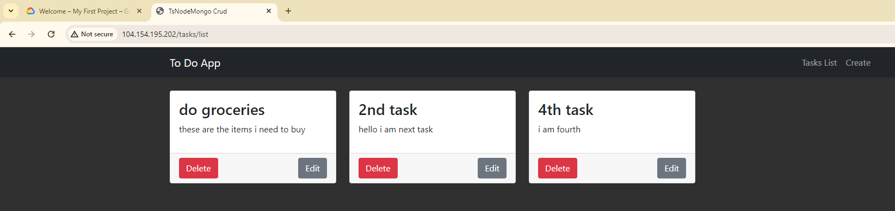

Successfully completed a comprehensive cloud computing project as part of the ECE 9013 course. The project involved deploying a web application with a database backend on Google Cloud Platform (GCP) using Kubernetes. Key achievements include:

Key Features of the Cloud Computing Project - ECE 9013

High-Availability Deployment: Implemented a high-availability web application using Kubernetes on Google Cloud Platform, ensuring continuous uptime and reliable performance.

Kubernetes Integration: Utilized Google Kubernetes Engine (GKE) for efficient cluster management and deployment across multiple nodes.
Load Balancing: Configured Cloud Load Balancing to distribute traffic evenly across the web application nodes, enhancing scalability and performance.

Database Management: Integrated Cloud SQL for robust and scalable database services, ensuring seamless interaction between the web application and the database backend.

Comprehensive Documentation: Developed detailed documentation including system architecture, deployment processes, high availability configurations, and step-by-step replication instructions.

External Accessibility: Configured external IP addresses and DNS management for public access to the application.
Monitoring and Operational Insights: Employed GCP Operations Suite for real-time monitoring and operational insights, enabling proactive management and optimization.

Innovative Use of GCP Services: Leveraged various GCP tools such as Container Registry for Docker image storage and Cloud Storage for static file management.


# Typescript Nodejs Mongodb CRUD op


# Installation guide
```bash
npm install
npm build
npm start
```

Full Tech Report can be found at Root directory file named Report.pdf


